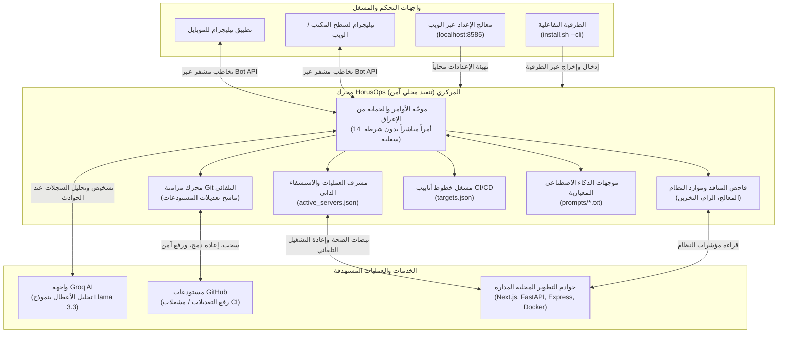

<p align="center">
  
</p>

<h1 align="center">HorusOps (دليل التشغيل والاستخدام)</h1>

<p align="center">
  <b>منظومة أتمتة DevOps ذاتية الاستشفاء، مزامنة Git الذكية، وإدارة الخوادم المدعومة بالذكاء الاصطناعي عبر تيليجرام</b>
  <br>
  <a href="README.md"><strong>[English] Read the English documentation here</strong></a>
</p>

<p align="center">
  <a href="LICENSE"></a>
  <a href="README.ar.md"></a>
  
  
  <a href="https://t.me/HorusOps_chat"></a>
  <a href="https://t.me/HorusOps"></a>
</p>

---

## نظرة عامة

مشروع **HorusOps** هو منصة تشغيل وأتمتة مفتوحة المصدر لبيئات التطوير والإنتاج (DevOps Orchestration Engine). مستوحى من الرمز المصري القديم للحماية واليقظة الدائمة (عين حورس / Wedjat). يوفر النظام مراقبة مستمرة على مدار الساعة، ومعالجة ذاتية للأعطال والخدمات المنهارة (Self-Healing)، ومزامنة دورية ذكية لمستودعات Git مع صياغة رسائل Commit دلالية باستخدام الذكاء الاصطناعي، ومركز قيادة متكامل عبر تيليجرام **يعمل محلياً بالكامل بدون خوادم تتبع وسيطة وبأمان تام (Zero Telemetry)**.

سواء كنت تدير خوادم ومشاريع متعددة (Node.js, Next.js, FastAPI, Django, Vite, Go, Docker) على جهازك الشخصي أو على خوادم سحابية و VPS، يمنحك HorusOps تحكماً كاملاً من هاتفك المحمول أو حاسوبك عبر تشفير مباشر.

---

## المخطط الهيكلي للنظام (Architecture Diagram)

يوضح المخطط التالي نموذج التفاعل الهندسي بين واجهات المشغل، محرك HorusOps المحلي، وأنظمة العمليات ومزودي الخدمات الخارجيين:



---

## القدرات والمزايا الأساسية

### 1. مركز عمليات ومراقبة عبر تيليجرام (24/7)
- **14 أمراً صارماً بدون شرطات سفلية**: بنية أوامر سهلة ومباشرة (`/status`, `/diagnose`, `/managerreport`, `/servers`, `/server`, `/startserver`, `/stopserver`, `/restart`, `/build`, `/sync`, `/repos`, `/report`, `/clearcache`, `/help`).
- **لوحات تحكم بأزرار تفاعلية**: إمكانية إيقاف، تشغيل، أو إعادة تشغيل أي خادم فوراً عبر نقرة واحدة على شاشة الموبايل.
- **دعم الرسائل الصوتية**: تفريغ صوتي وتحليل ذكي للأوامر المنطوقة باستخدام نموذج الذكاء الاصطناعي المدمج.
- **طوابع زمنية دقيقة**: توثيق لحظي لكل أمر وحالة بالثانية والدقيقة (`HH:MM:SS`).

### 2. الاستشفاء الذاتي ومراقبة العمليات (`servers.json`)
- فحص دوري مستمر لحالة العمليات النشطة (`active_servers.json`) والمنافذ المحجوزة.
- إعادة تشغيل تلقائية للخدمات عند انهيارها المفاجئ.
- تنظيف وتصفية العمليات المعلقة (Zombies / Orphaned PIDs) لضمان تحرير المنافذ دائماً.

### 3. أتمتة مستودعات Git المتعددة ومكافحة تسريب الأسرار
- مسح ذكي لجميع المجلدات الفرعية لاكتشاف المستودعات البرمجية وتتبع التعديلات غير المحفوظة.
- حماية استباقية صارمة: فك وإلغاء تجهيز أي ملفات حساسة (`*.env`, `*.key`, `*.pem`, `id_rsa*`) قبل تنفيذ أي عملية Commit.
- توليد رسائل Commit دلالية ومنظمة تلقائياً بالذكاء الاصطناعي.
- تنفيذ السحب الآمن بالتكامل (`git pull --rebase`) والرفع للمستودع البعيد (`git push`).

### 4. محرك خطوط الأنابيب والبناء المستمر (`targets.json`)
- تشغيل مهام بناء التطبيقات آلياً (مثل إصدارات Flutter، بناء حاويات Docker، تشغيل الاختبارات، أو النشر).
- إرسال تقارير وسجلات البناء فور انتهائها مباشرة إلى تيليجرام.

### 5. معالج إعداد عبر الويب بدون أي مكتبات خارجية (`setup_wizard.py`)
- واجهة رسومية سريعة وخفيفة تعمل بمكتبات بايثون القياسية عبر المتصفح `http://localhost:8585`.
- فاحص اتصال حي ومباشر مع Telegram (`getMe`)، و Groq (`models.list`)، و GitHub (`/user`).
- استكشاف تلقائي للمشاريع والخوادم مع إمكانية تصفح المجلدات بنقرة واحدة.

### 6. تخصيص موجهات الذكاء الاصطناعي (`prompts/`)
- ملفات نصوص مستقلة قابلة للتعديل بحرية:
  - `manager_report.txt`: صياغة التقارير التنفيذية الدورية.
  - `diagnose.txt`: قواعد تفكيك سجلات الأخطاء والتشخيص الجذري.
  - `chat.txt`: قواعد الإجابة التفاعلية والدردشة التقنية.
- إمكانية تعديلها وحفظها أو استعادة ضبط المصنع مباشرة من التبويب [5] في معالج الإعداد.

---

## البدء السريع

### 1. استنساخ المستودع
```bash
git clone https://github.com/ElShaikh1945/HorusOps.git
cd HorusOps
```

### 2. تشغيل الإعداد الآلي الموحد (One-Step Installer)
نفذ سكربت التثبيت والإطلاق:
```bash
./install.sh
```

> **للخوادم البعيدة و VPS (بدون واجهة رسومية)**: افتح المعالج التفاعلي في الطرفية مباشرة:
> ```bash
> ./install.sh --cli
> ```

افتح الرابط `http://localhost:8585` في متصفحك:
1. **توكن البوت ومعرف تيليجرام**: أدخل التوكن واضغط **التقاط المعرّف تلقائياً** (أو أرسل أي رسالة للبوت على تيليجرام).
2. **مسار المشاريع**: اضغط **تصفح مجلد...** لاختيار بيئة عملك (يدعم إضافة عدة مسارات).
3. **الخوادم المحلية**: اضغط **اكتشاف الخوادم تلقائياً** لاكتشاف بيئات العمل النشطة تلقائياً.
4. (اختياري) أدخل **مفتاح Groq API** للتشخيص الذكي و **توكن GitHub** لمهام البناء.
5. اضغط **حفظ الإعدادات**.

---

## تشغيل وإدارة الخدمات

### التشغيل المباشر
تثبيت الحزم المطلوبة:
```bash
pip install -r requirements.txt
```

تشغيل بوت تيليجرام:
```bash
./scripts/run_bot.sh
```

تشغيل مزامنة Git يدوياً:
```bash
./scripts/run_sync.sh
```

---

### التثبيت كخدمة تعمل في الخلفية مع بدء التشغيل

#### على نظام ماك (macOS launchd)
```bash
./scripts/install_launchd.sh
```
- متابعة السجلات لحظياً: `tail -f server_logs/bot_stdout.log`
- إيقاف الخدمة: `launchctl stop com.waisoft.bot`
- إلغاء التثبيت: `launchctl unload ~/Library/LaunchAgents/com.waisoft.bot.plist`

#### على أنظمة لينكس (Linux systemd)
```bash
./scripts/install_systemd.sh
```
- حالة الخدمة: `systemctl --user status waisoft-bot.service`
- إعادة التشغيل: `systemctl --user restart waisoft-bot.service`
- السجلات: `journalctl --user -u waisoft-bot.service -f`

---

## مرجع أوامر بوت تيليجرام

تتبع جميع الأوامر نسقاً دقيقاً **بدون شرطات سفلية**:

| الأمر | الوصف | مثال |
| :--- | :--- | :--- |
| `/status` | تقرير فوري شامل لحالة المعالج، الرام، الأقراص، والعمليات النشطة | `/status` |
| `/managerreport` | ملخص إداري تنفيذي للمستودعات، التنبيهات، وفترات التشغيل | `/managerreport` |
| `/diagnose [target]` | تشخيص ذكي للأعطال وسجلات الخوادم باستخدام الذكاء الاصطناعي | `/diagnose backend` |
| `/servers` | استعراض الخوادم مع لوحة أزرار تفاعلية للتحكم الفوري | `/servers` |
| `/server <name>` | فحص دقيق لحالة المنفذ ومعرف العملية (PID) لخادم محدد | `/server web` |
| `/startserver <name>` | تشغيل خادم محدد من القائمة | `/startserver web` |
| `/stopserver <name>` | إيقاف خادم يعمل في الخلفية بأمان | `/stopserver web` |
| `/restart <name>` | إعادة تشغيل خادم محدد أو معلق | `/restart web` |
| `/build <target>` | تشغيل مسار بناء وأتمتة محدد من خطوط CI/CD | `/build mobile` |
| `/sync` | إطلاق دورة مزامنة فورية وشاملة لجميع مستودعات Git | `/sync` |
| `/repos` | قائمة بالمستودعات المكتشفة وتطابقها مع الفروع البعيدة | `/repos` |
| `/report` | ملخص سريع لعمليات Commit اليوم وساعات عمل الخوادم | `/report` |
| `/clearcache` | مسح الذاكرة المؤقتة للتشخيص وسجلات الأخطاء القديمة | `/clearcache` |
| `/help` | عرض دليل الاستخدام والمساعدة السريعة | `/help` |

---

## الأمان والخصوصية وحماية البيانات

- **تنفيذ محلي بدون أي تسريب (Zero Telemetry)**: لا توجد أي خوادم تحليلية أو وسيطة. الاتصال ينحصر حصرياً بين خادمك وواجهات البرمجة المعتمدة منك (Telegram, Groq, GitHub).
- **درع حماية الأسرار البرمجية**: آلية مدمجة تمنع رفع المفاتيح والبيانات الحساسة (`*.env`, `*.key`, `*.pem`, `id_rsa*`) إلى Git حتى لو تم تعديلها سهواً.
- **حصر الصلاحيات بالمعرّف الرقمي**: تجاهل أي رسالة أو أمر يرد من حسابات غير مصرح لها في `TELEGRAM_ADMIN_IDS`.
- **الوقاية من هجمات حقن الأوامر (Command Injection)**: تمرير المعاملات كـ Tokens محددة عبر بيئة استدعاء معزولة دون الاعتماد على مفسرات الطرفية الخام (`shell=False`).

---

## المجتمع، الأخبار والدعم الفني

- **مجموعة النقاش والدعم عبر تيليجرام**: [t.me/HorusOps_chat](https://t.me/HorusOps_chat)
- **قناة الأخبار والتحديثات الرسمية**: [t.me/HorusOps](https://t.me/HorusOps)
- **المستودع الرسمي على GitHub**: [github.com/ElShaikh1945/HorusOps](https://github.com/ElShaikh1945/HorusOps)
- **قسم الإبلاغ عن المشاكل والمقترحات**: [github.com/ElShaikh1945/HorusOps/issues](https://github.com/ElShaikh1945/HorusOps/issues)
- **المطور والمشرف على المشروع**: محمد الشيخ ([muhammad.al-shaikh@outlook.com](mailto:muhammad.al-shaikh@outlook.com))

---

## الترخيص

هذا المشروع مرخص بموجب **رخصة MIT** مفتوحة المصدر - راجع ملف [LICENSE](LICENSE) لمزيد من التفاصيل.
