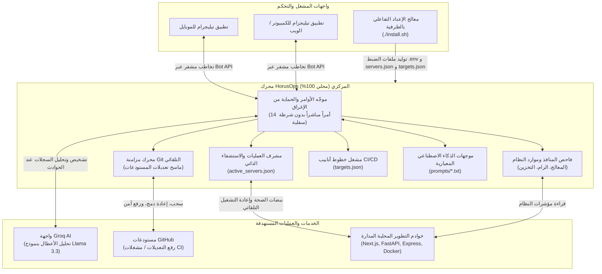

<p align="center">
  
</p>

<h1 align="center">HorusOps (دليل التشغيل والاستخدام)</h1>

<p align="center">
  <b>منظومة أتمتة DevOps ذاتية الاستشفاء، مزامنة Git الذكية، وإدارة الخوادم المدعومة بالذكاء الاصطناعي عبر تيليجرام</b>
  <br>
  <a href="README.md"><strong>[English] Read the English documentation here</strong></a>
</p>

<p align="center">
  <a href="LICENSE"></a>
  <a href="README.ar.md"></a>
  
  
  
  <a href="https://t.me/HorusOps_chat"></a>
  <a href="https://t.me/HorusOps"></a>
</p>

---

## نظرة عامة

مشروع **HorusOps** هو منصة أتمتة وإشراف هندسي متاحة المصدر للإطلاع فقط (Source-Available) لبيئات التطوير والإنتاج (DevOps Orchestration Platform). استُلهم الاسم من الرمز المصري القديم لليقظة والحماية الدائمة (عين حورس / Wedjat). يوفر النظام مراقبة مستمرة على مدار الساعة، ومعالجة ذاتية للأعطال وإعادة تشغيل الخوادم المنهارة (Self-Healing)، ومزامنة دورية ذكية لمستودعات Git مع صياغة رسائل Commit دلالية بالذكاء الاصطناعي، ومركز تحكم كامل عبر تيليجرام.

النظام مصمم ليعمل بنسبة **100% عبر الطرفية والسطر البرمجي (100% CLI & Terminal Native)**:
- **بدون أي خوادم ويب أو فتح منافذ**: تم الاستغناء بالكامل عن المتصفحات وخوادم الويب المحلية؛ الإعداد يتم عبر محادثة تفاعلية مباشرة في الطرفية.
- **جاهز للعمل على السيرفرات البعيدة و VPS**: يعمل بسلاسة عبر جلسات SSH والأنظمة الموجهة للطرفية (Headless Servers).
- **دعم ثنائي اللغة سلس (عربي / إنجليزي)**: يمكنك اختيار لغة معالج الإعداد فور تشغيله بضغطة زر واحدة.
- **أمان محلي كامل (Zero Telemetry)**: لا توجد أي خوادم وسيطة تجمع بياناتك، والتنفيذ بالكامل داخل بيئة جهازك.

---

## المخطط الهيكلي للنظام (Architecture Diagram)



---

## القدرات والمزايا الأساسية

### 1. مركز تحكم ومراقبة عبر تيليجرام (24/7)
- **14 أمراً صارماً بدون شرطات سفلية**: بنية أوامر واضحة وسريعة (`/status`, `/diagnose`, `/managerreport`, `/servers`, `/server`, `/startserver`, `/stopserver`, `/restart`, `/build`, `/sync`, `/repos`, `/report`, `/clearcache`, `/help`).
- **لوحات أزرار تفاعلية**: إمكانية إيقاف، تشغيل، أو إعادة تشغيل أي خادم بنقرة واحدة من شاشة الهاتف.
- **دعم الرسائل الصوتية**: تفريغ صوتي وتحليل الأوامر المنطوقة باستخدام نموذج الذكاء الاصطناعي المدمج.
- **طوابع زمنية دقيقة**: توثيق لحظي لكل أمر وحالة بالثانية والدقيقة (`HH:MM:SS`).

### 2. الاستشفاء الذاتي ومراقبة العمليات (`servers.json`)
- فحص مستمر لصحة العمليات والمنافذ الشبكية المستهدفة.
- إعادة تشغيل تلقائية للخدمات عند تعطلها المفاجئ دون تدخل بشري.
- تصفية وتنظيف العمليات المعلقة (Zombies / Orphaned PIDs) لمنع انسداد المنافذ.

### 3. أتمتة مستودعات Git المتعددة وحماية الأسرار البرمجية
- مسح ذكي للمستودعات لاكتشاف التعديلات البرمجية غير المحفوظة.
- درع حماية الأسرار: إلغاء تجهيز وفك الملفات الحساسة (`*.env`, `*.key`, `*.pem`, `id_rsa*`) قبل تنفيذ أي عملية Commit.
- صياغة رسائل Commit دلالية ومنظمة تلقائياً بالذكاء الاصطناعي.
- تنفيذ السحب بالتكامل (`git pull --rebase`) والرفع الآمن للمستودع البعيد (`git push`).

### 4. محرك خطوط الأنابيب والبناء المستمر (`targets.json`)
- تشغيل مسارات البناء والأتمتة (مثل Flutter builds، بناء حاويات Docker، تشغيل الاختبارات، ونشر الحزم).
- إرسال تقارير وسجلات البناء فور انتهائها مباشرة إلى تيليجرام.

### 5. معالج إعداد تفاعلي بالكامل عبر الطرفية (`setup_wizard.py`)
- تشغيل فوري بدون أي مكتبات خارجية إضافية اعتماداً على مكتبات بايثون القياسية.
- فاحص اتصال حي ومباشر مع Telegram (`getMe`)، و Groq (`models.list`)، و GitHub (`/user`).
- التقاط تلقائي لمعرف مستخدم تيليجرام من الرسائل الواردة.
- اكتشاف تلقائي للخوادم والمشاريع وتوليد ملف `servers.json` فوراً.

### 6. تخصيص موجهات الذكاء الاصطناعي (`prompts/`)
- ملفات نصوص معيارية ومستقلة:
  - `manager_report.txt`: صياغة التقارير الإدارية والتنفيذية.
  - `diagnose.txt`: قواعد تفكيك سجلات الأخطاء والتشخيص الجذري.
  - `chat.txt`: قواعد المحادثة التفاعلية والاستعلامات التشغيلية.

---

## البدء السريع (الإعداد التفاعلي عبر الطرفية)

### 1. استنساخ المستودع
```bash
git clone https://github.com/ElShaikh1945/HorusOps.git
cd HorusOps
```

### 2. تشغيل الإعداد الآلي
قم بتشغيل سكربت التثبيت والإعداد مباشرة في سطر الأوامر:
```bash
./install.sh
```

### 3. متابعة خطوات المعالج التفاعلي في الطرفية

```text
====================================================================
 [HORUS-OPS] Autonomous DevOps & Server Orchestration Platform
 Interactive Terminal Configuration Wizard
====================================================================
Select Language / اختر لغة الإعداد:
  [1] العربية (الافتراضية)
  [2] English
Option / الاختيار [1]: 1
--------------------------------------------------------------------
ملاحظة: اضغط Enter للموافقة على القيمة الافتراضية المعروضة بين أقواس [].

1. توكن بوت تيليجرام (Telegram Bot Token): <ألصق التوكن من BotFather>
   [*] جاري التحقق من التوكن عبر Telegram API...
   [OK] تم التحقق من البوت: HorusOpsBot (@HorusOps_bot)

2. معرّف تيليجرام الرقمي (Telegram User/Chat ID):
   أدخل المعرف أو اضغط Enter للالتقاط التلقائي []: <اضغط Enter>
   [*] جاري فحص الرسائل الواردة للبوت لالتقاط المعرف...
   [OK] تم التقاط المعرف بنجاح: 123456789 (محمد)

3. مسار مجلد المشاريع (Projects Base Directory) [/home/user/projects]: /var/www/apps
   [*] جاري فحص واكتشاف مستودعات Git...
   [OK] تم العثور على 4 مستودع Git.

4. مفتاح Groq API لتشخيص الأعطال والتقارير الذكية (اختياري): gsk_...
   [*] التحقق من صلاحية مفتاح Groq...
   [OK] مفتاح Groq صالح. النماذج المتاحة: 12

5. توكن GitHub الشخصي لمهام البناء و CI/CD (اختياري): ghp_...
   [*] التحقق من توكن GitHub...
   [OK] تم التحقق من توكن GitHub للمستخدم: @ElShaikh1945

[*] فحص المشاريع واكتشاف الخوادم المحلية وتوليد servers.json...
   [OK] تم تجهيز وتعريف 3 خادم(ات) في servers.json.

====================================================================
 [OK] تم حفظ جميع الإعدادات بنجاح في:
   - .env (بيانات الاعتماد المشفرة محلياً)
   - servers.json (تعريفات الخوادم المحلية)
   - targets.json (أهداف البناء CI/CD)
   - prompts/ (موجهات الذكاء الاصطناعي)
====================================================================
```

---

## تشغيل وإدارة الخدمات

### التشغيل المباشر عبر الطرفية
تثبيت المتطلبات:
```bash
pip install -r requirements.txt
```

تشغيل بوت تيليجرام:
```bash
./scripts/run_bot.sh
```

تشغيل دورة مزامنة Git يدوياً:
```bash
./scripts/run_sync.sh
```

---

### التشغيل كخدمة خلفية دائمة مع إقلاع النظام

#### على أنظمة لينكس (Linux systemd)
```bash
./scripts/install_systemd.sh
```
- حالة الخدمة: `systemctl --user status horusops-bot.service`
- إعادة التشغيل: `systemctl --user restart horusops-bot.service`
- السجلات المباشرة: `journalctl --user -u horusops-bot.service -f`

#### على نظام ماك (macOS launchd)
```bash
./scripts/install_launchd.sh
```
- متابعة السجلات المباشرة: `tail -f server_logs/bot_stdout.log`
- إيقاف الخدمة: `launchctl stop com.horusops.bot`
- إلغاء التثبيت: `launchctl unload ~/Library/LaunchAgents/com.horusops.bot.plist`

---

## مرجع أوامر بوت تيليجرام

تتبع جميع الأوامر نسقاً واضحاً **بدون شرطات سفلية**:

| الأمر | الوصف | مثال |
| :--- | :--- | :--- |
| `/status` | تقرير فوري شامل لحالة المعالج، الرام، التخزين، والخوادم المراقبة | `/status` |
| `/managerreport` | تقرير إداري تنفيذي للمستودعات، التنبيهات التشغيلية، وفترات العمل | `/managerreport` |
| `/diagnose [target]` | تشخيص وتحليل جذري للأعطال وسجلات الخوادم بالذكاء الاصطناعي | `/diagnose backend` |
| `/servers` | استعراض الخوادم مع لوحة تحكم بأزرار تفاعلية | `/servers` |
| `/server <name>` | فحص دقيق للمنفذ ومعرف العملية (PID) لخادم محدد | `/server web` |
| `/startserver <name>` | تشغيل خادم محدد من القائمة | `/startserver web` |
| `/stopserver <name>` | إيقاف خادم يعمل في الخلفية بأمان | `/stopserver web` |
| `/restart <name>` | إعادة تشغيل خادم محدد أو معلق | `/restart web` |
| `/build <target>` | تشغيل مسار بناء وأتمتة محدد من خطوط CI/CD | `/build mobile` |
| `/sync` | إطلاق دورة مزامنة فورية لجميع مستودعات Git | `/sync` |
| `/repos` | قائمة بالمستودعات المكتشفة وحالة تطابقها مع الفروع البعيدة | `/repos` |
| `/report` | ملخص يومي لعمليات Commit وساعات عمل الخوادم | `/report` |
| `/clearcache` | تنظيف الذاكرة المؤقتة وسجلات الأخطاء القديمة | `/clearcache` |
| `/help` | عرض دليل الاستخدام والمساعدة السريعة | `/help` |

---

## الأمان والخصوصية وحماية البيانات

- **تنفيذ محلي بدون أي تسريب (Zero Telemetry)**: لا توجد أي خوادم تحليلية أو وسيطة. الاتصال ينحصر حصرياً بين خادمك وواجهات البرمجة المعتمدة منك (Telegram, Groq, GitHub).
- **درع حماية الأسرار البرمجية**: آلية مدمجة تمنع رفع المفاتيح والبيانات الحساسة (`*.env`, `*.key`, `*.pem`, `id_rsa*`) إلى Git حتى لو تم تعديلها سهواً.
- **حصر الصلاحيات بالمعرّف الرقمي**: تجاهل أي رسالة أو أمر يرد من حسابات غير مصرح لها في `TELEGRAM_ADMIN_IDS`.
- **الوقاية من هجمات حقن الأوامر (Command Injection)**: تمرير المعاملات كـ Tokens محددة عبر بيئة استدعاء معزولة دون الاعتماد على مفسرات الطرفية الخام (`shell=False`).

---

## المجتمع، الأخبار والدعم الفني

- **مجموعة النقاش والدعم عبر تيليجرام**: [t.me/HorusOps_chat](https://t.me/HorusOps_chat)
- **قناة الأخبار والتحديثات الرسمية**: [t.me/HorusOps](https://t.me/HorusOps)
- **المستودع الرسمي على GitHub**: [github.com/ElShaikh1945/HorusOps](https://github.com/ElShaikh1945/HorusOps)
- **قسم الإبلاغ عن المشاكل والمقترحات**: [github.com/ElShaikh1945/HorusOps/issues](https://github.com/ElShaikh1945/HorusOps/issues)
- **المطور والمشرف على المشروع**: محمد الشيخ ([muhammad.al-shaikh@outlook.com](mailto:muhammad.al-shaikh@outlook.com))

---

## شكر وتقدير

يحتوي المجلد الفرعي لمزامنة Git التلقائية (`git_auto_sync/`) على كود تأسيسي مقتبس من مشروع [git-auto-sync](https://github.com/OctopusGarage/git-auto-sync) التابع لـ OctopusGarage، والمرخص بموجب رخصة MIT. كافة مكونات المنصة الأخرى، ومشرف الخوادم، ومحرك CI/CD، وخادم بوت تيليجرام، ومعالج الإعداد هي برمجيات احتكارية خاصة بمنصة HorusOps.

---

## الترخيص (حقوق الملكية الفكرية)

حقوق النشر (c) 2026 محمد الشيخ. جميع الحقوق محفوظة.

هذا المشروع **احتكاري ومتاح المصدر للإطلاع الشخصي والتقييم الأكاديمي فقط (Proprietary - Source Available for Viewing Only)**. يُحظر تماماً نسخ الكود، أو تعديله، أو إعادة نشره وتوزيعه، أو استخدامه تجارياً أو تشغيله في بيئات الإنتاج دون الحصول على إذن كتابي وصريح ومسبق من صاحب حقوق النشر. راجع ملف [LICENSE](LICENSE) لكافة التفاصيل والشروط القانونية.
