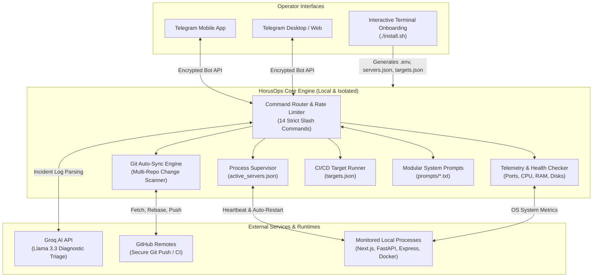

<p align="center">
  
</p>

<h1 align="center">HorusOps</h1>

<p align="center">
  <b>Autonomous Self-Healing DevOps Platform, Git Auto-Sync & AI-Driven Server Orchestrator via Telegram</b>
  <br>
  <a href="README.ar.md"><strong>[العربية] اقرأ دليل التشغيل الكامل باللغة العربية</strong></a>
</p>

<p align="center">
  <a href="LICENSE"></a>
  <a href="README.ar.md"></a>
  
  
  
  <a href="https://t.me/HorusOps_chat"></a>
  <a href="https://t.me/HorusOps"></a>
</p>

---

## Overview

**HorusOps** is an autonomous, open-source DevOps and infrastructure orchestration agent designed for production and developer environments. Inspired by the ancient Egyptian symbol of vigilance and protection (The Eye of Horus / Wedjat), HorusOps operates 24/7 to monitor processes, execute self-healing recoveries on crashed servers, automate Git repository commits with semantic AI analysis, and deliver a comprehensive command center straight to your phone via Telegram.

HorusOps is **100% Terminal & CLI Native**:
- **Zero Web Server Overhead**: No background HTTP daemons, no browser requirements, and no listening ports for configuration.
- **SSH & Headless Ready**: Designed from the ground up for remote VPS instances, cloud droplets, Linux servers, and local terminal workflows.
- **Bilingual Interactive Onboarding**: Seamless step-by-step setup in both Arabic and English directly inside your terminal.
- **Zero Telemetry**: All data remains strictly local with direct encrypted API communication.

---

## Architecture Diagram



---

## Core Capabilities

### 1. 24/7 Telegram Command & Telemetry Center
- **14 Strict Slash Commands (No Underscores)**: `/status`, `/diagnose`, `/managerreport`, `/servers`, `/server`, `/startserver`, `/stopserver`, `/restart`, `/build`, `/sync`, `/repos`, `/report`, `/clearcache`, `/help`.
- **Interactive Inline Keyboards**: Instant buttons for process control, server reboot, and target triggering.
- **Voice Message Processing**: Real-time voice query transcription and execution via Groq AI.
- **Auditing Timestamps**: Exact microsecond timestamps (`HH:MM:SS`) on all status reports and logs.

### 2. Autonomous Self-Healing & Process Supervisor (`servers.json`)
- Continuous health checks on active ports and process IDs.
- Automatic recovery and reboot of crashed development and staging services.
- Clean process termination to prevent zombie PIDs and blocked ports.

### 3. Automated Git Multi-Repository Synchronization
- Scans base directories recursively for Git repositories.
- Automatic secret shielding: resets and unstages sensitive files (`*.env`, `*.key`, `*.pem`, `id_rsa*`) prior to commit.
- Semantic commit message authoring via modular AI prompt logic.
- Safe automated `git pull --rebase` and `git push` routines.

### 4. Native CI/CD Pipeline Engine (`targets.json`)
- Configurable pipeline targets (e.g., Docker deployments, Flutter builds, automated test suites, PyPI package releases).
- Instant delivery of build logs and exit status codes directly to Telegram.

### 5. Interactive Terminal Configuration Engine (`setup_wizard.py`)
- Zero dependencies: runs purely on Python standard library modules.
- Live API validation for Telegram tokens, Groq keys, and GitHub access tokens.
- Automatic Telegram User ID detection via incoming message polling.
- Automatic framework and port discovery (Next.js, Vite, Django, FastAPI, Flask, Python scripts).

### 6. Modular AI System Prompts (`prompts/`)
- Plain-text prompt configurations in `prompts/`:
  - `manager_report.txt`: Executive operational summaries.
  - `diagnose.txt`: Error log triage and root-cause extraction.
  - `chat.txt`: Conversational ops assistance.

---

## Quick Start (Interactive Terminal Onboarding)

### 1. Clone the Repository
```bash
git clone https://github.com/ElShaikh1945/HorusOps.git
cd HorusOps
```

### 2. Run the Interactive Installer
Execute the automated setup script directly in your terminal:
```bash
./install.sh
```

### 3. Follow the Step-by-Step Terminal Prompts

```text
====================================================================
 [HORUS-OPS] Autonomous DevOps & Server Orchestration Platform
 Interactive Terminal Configuration Wizard
====================================================================
Select Language / اختر لغة الإعداد:
  [1] العربية (الافتراضية)
  [2] English
Option / الاختيار [1]: 2
--------------------------------------------------------------------
1. Telegram Bot Token: <Paste token from @BotFather>
   [*] Verifying bot token with Telegram API...
   [OK] Verified: HorusOpsBot (@HorusOps_bot)

2. Telegram Numerical User/Chat ID:
   Enter User ID or press Enter for auto-detect: <Press Enter>
   [*] Polling incoming updates...
   [OK] Auto-detected User ID: 123456789 (Muhammad)

3. Projects Base Directory [/home/user/projects]: /var/www/apps
   [*] Scanning repositories...
   [OK] Discovered 4 Git repositories.

4. Groq API Key for AI incident diagnostics (optional): gsk_...
   [*] Testing Groq API key...
   [OK] Groq API valid. Models available: 12

5. GitHub Personal Access Token for CI/CD (optional): ghp_...
   [*] Testing GitHub token...
   [OK] GitHub authenticated as: @ElShaikh1945

[*] Discovering local servers and runtimes...
   [OK] Configured 3 server definition(s) in servers.json.

====================================================================
 [OK] Configuration saved successfully:
   - .env (Encrypted local credentials)
   - servers.json (Monitored server processes)
   - targets.json (CI/CD pipeline targets)
   - prompts/ (Modular AI system prompts)
====================================================================
```

---

## Service Execution & Management

### Run Directly in Terminal
Install requirements:
```bash
pip install -r requirements.txt
```

Launch the Telegram Bot Daemon:
```bash
./scripts/run_bot.sh
```

Trigger Git Auto-Sync manually:
```bash
./scripts/run_sync.sh
```

---

### Running as a Persistent Background Daemon (Auto-Start on Boot)

#### On Linux (`systemd`)
Install the user-level systemd service:
```bash
./scripts/install_systemd.sh
```
- Service Status: `systemctl --user status waisoft-bot.service`
- Restart Daemon: `systemctl --user restart waisoft-bot.service`
- Live Logs: `journalctl --user -u waisoft-bot.service -f`

#### On macOS (`launchd`)
Install the persistent launch agent:
```bash
./scripts/install_launchd.sh
```
- Live Logs: `tail -f server_logs/bot_stdout.log`
- Stop Daemon: `launchctl stop com.waisoft.bot`
- Unload Daemon: `launchctl unload ~/Library/LaunchAgents/com.waisoft.bot.plist`

---

## Telegram Bot Command Reference

All commands follow strict syntax (**no underscores**):

| Command | Description | Example |
| :--- | :--- | :--- |
| `/status` | Full health telemetry: CPU, RAM, Disk space, and monitored servers | `/status` |
| `/managerreport` | Executive summary of Git activity, operational alerts, and uptime | `/managerreport` |
| `/diagnose [target]` | AI-powered incident triage and root-cause analysis on logs | `/diagnose backend` |
| `/servers` | Interactive dashboard of all configured servers with action buttons | `/servers` |
| `/server <name>` | Detailed status, PID, and port health for a specific process | `/server web` |
| `/startserver <name>` | Start a configured server process | `/startserver web` |
| `/stopserver <name>` | Stop a running server process safely | `/stopserver web` |
| `/restart <name>` | Restart a running or stalled server process | `/restart web` |
| `/build <target>` | Trigger an automated CI/CD pipeline target | `/build mobile` |
| `/sync` | Force immediate synchronization cycle across all Git repositories | `/sync` |
| `/repos` | List all tracked Git repositories and remote branch sync status | `/repos` |
| `/report` | Daily summary of Git commits, authors, and server uptime | `/report` |
| `/clearcache` | Flush diagnostic cache entries, error logs, and temporary state | `/clearcache` |
| `/help` | Display interactive command manual and syntax reference | `/help` |

---

## Configuration Reference

### 1. Environment Variables (`.env`)
```ini
# Telegram Authentication
TELEGRAM_BOT_TOKEN="123456789:ABCdefGhIJKlmNoPQRsTUVwxyZ"
TELEGRAM_CHAT_ID="123456789"
TELEGRAM_ADMIN_IDS="123456789"

# AI Incident Analysis (Groq)
GROQ_API_KEY="gsk_xxxxxxxxxxxxxxxxxxxxxx"
GROQ_MODEL="llama-3.3-70b-versatile"

# GitHub Token
GITHUB_TOKEN="ghp_xxxxxxxxxxxxxxxxxxxxxx"

# Git Auto-Sync Policy
SYNC_BASE_DIR="/path/to/your/projects"
SYNC_IGNORED_NAMES=".git,node_modules,dist,build,.venv"
SYNC_PUSH="true"
SYNC_INTERVAL_MINUTES="30"
```

### 2. Server Process Specifications (`servers.json`)
```json
{
  "web": {
    "name": "Frontend Web App",
    "cwd": "/path/to/projects/frontend",
    "cmd": "npm run dev",
    "port": 3000,
    "aliases": ["web", "frontend", "ui"]
  },
  "api": {
    "name": "Backend API",
    "cwd": "/path/to/projects/backend",
    "cmd": "python3 main.py",
    "port": 8000,
    "aliases": ["api", "backend", "server"]
  }
}
```

### 3. Pipeline Build Targets (`targets.json`)
```json
{
  "mobile-release": {
    "name": "Flutter Android Release",
    "cwd": "/path/to/projects/mobile",
    "cmd": "flutter build apk --release",
    "notify_on": "always"
  },
  "docker-deploy": {
    "name": "Docker Production Deploy",
    "cwd": "/path/to/projects/api",
    "cmd": "docker-compose up -d --build",
    "notify_on": "failure"
  }
}
```

---

## Security & Privacy Architecture

- **Zero External Telemetry**: All operations run locally on your host. Network calls are strictly limited to your configured Telegram, Groq, and GitHub endpoints.
- **Leak-Proof Git Staging**: Automated credential guards unstage and reset sensitive files (`*.env`, `*.key`, `*.pem`, `id_rsa*`) before any commit is crafted.
- **Admin Verification Fence**: Unauthorized Telegram user IDs are silently ignored.
- **Safe Subprocess Spawning**: Commands execute with explicit tokenized argument vectors (`shell=False`) to eliminate command injection risks.

---

## Community, News & Support

- **Telegram Support & Discussion**: [t.me/HorusOps_chat](https://t.me/HorusOps_chat)
- **Telegram Updates Channel**: [t.me/HorusOps](https://t.me/HorusOps)
- **Official Repository**: [github.com/ElShaikh1945/HorusOps](https://github.com/ElShaikh1945/HorusOps)
- **Issue Tracker**: [github.com/ElShaikh1945/HorusOps/issues](https://github.com/ElShaikh1945/HorusOps/issues)
- **Author**: Muhammad Al-Shaikh ([muhammad.al-shaikh@outlook.com](mailto:muhammad.al-shaikh@outlook.com))

---

## License

This project is licensed under the **MIT License** - see the [LICENSE](LICENSE) file for details.
