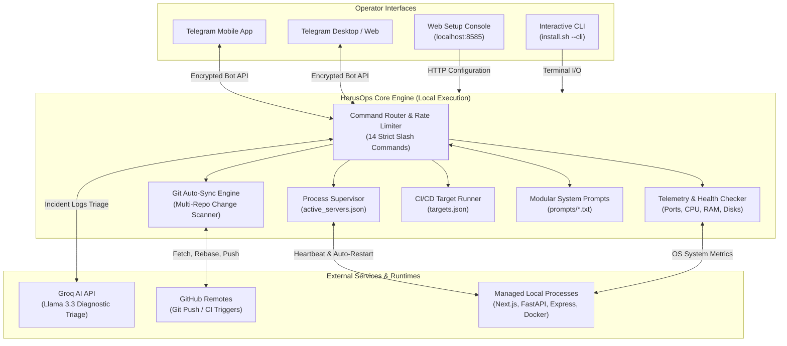

<p align="center">
  
</p>

<h1 align="center">HorusOps</h1>

<p align="center">
  <b>Autonomous Self-Healing DevOps Platform, Git Auto-Sync & AI-Driven Server Orchestrator via Telegram</b>
  <br>
  <a href="README.ar.md"><strong>[العربية] اقرأ دليل التشغيل الكامل باللغة العربية</strong></a>
</p>

<p align="center">
  <a href="LICENSE"></a>
  <a href="README.ar.md"></a>
  
  
  <a href="https://t.me/HorusOps_chat"></a>
  <a href="https://t.me/HorusOps"></a>
</p>

---

## Overview

**HorusOps** is an autonomous, open-source DevOps and infrastructure orchestration agent. Named after the ancient Egyptian symbol of vigilance and protection (The Eye of Horus / Wedjat), HorusOps monitors development and production environments 24/7, executes self-healing recovery on failed processes, synchronizes Git repositories automatically with AI-generated semantic commit messages, and provides a full-featured, zero-telemetry control center directly via Telegram.

Whether managing multiple microservices (Node.js, Next.js, FastAPI, Django, Vite, Go, Docker) on local developer machines or distributed VPS instances, HorusOps operates entirely locally with **zero cloud dependencies, zero external tracking, and end-to-end cryptographic control**.

---

## Architecture Diagram

The following architecture diagram demonstrates the end-to-end interaction model between the Telegram operator, the HorusOps Core Daemon, the local process supervision engine, and the external AI/Git providers:



---

## Core Capabilities

### 1. 24/7 Telegram Command & Telemetry Center
- **14 Strict Slash Commands (No Underscores)**: Clean, unambiguous syntax (`/status`, `/diagnose`, `/managerreport`, `/servers`, `/server`, `/startserver`, `/stopserver`, `/restart`, `/build`, `/sync`, `/repos`, `/report`, `/clearcache`, `/help`).
- **Interactive Inline Dashboards**: Real-time buttons for immediate server restart, process lifecycle toggling, and target builds.
- **Voice Message Analysis**: Audio queries sent to the bot are transcribed and routed intelligently via the Groq AI model.
- **Precision Auditing**: All responses and system messages feature microsecond execution timestamps (`HH:MM:SS`).

### 2. Autonomous Self-Healing & Process Supervisor (`servers.json`)
- Continuously inspects active server states (`active_servers.json`) and listening network ports.
- Automatically recovers and restarts crashed development and staging services.
- Eliminates orphaned child processes during unexpected reboots or shell terminations.

### 3. Automated Git Multi-Repository Synchronization
- Recursively monitors local repository directories for file modifications.
- Automatically resets, unstages, and excludes sensitive secrets (`*.env`, `*.key`, `*.pem`, `id_rsa*`) before staging.
- Formulates clean, semantic Git commit messages using modular AI prompt logic.
- Executes `git pull --rebase` and `git push` safely with comprehensive failure reporting.

### 4. Native CI/CD Pipeline Engine (`targets.json`)
- Triggers custom local or remote pipeline jobs (e.g., Docker deployments, Flutter builds, test suites, package publishing).
- Delivers instantaneous pipeline logs and execution pass/fail metrics directly to Telegram.

### 5. Zero-Dependency Web Setup Console (`setup_wizard.py`)
- Single-file setup wizard running purely on standard Python library (`http.server`).
- Dynamic connection testers for Telegram (`getMe`), Groq (`models.list`), and GitHub (`/user`).
- Integrated folder browser and automatic discovery for local servers and Git repositories.

### 6. Modular AI System Prompts (`prompts/`)
- Plain-text prompt configuration files in `prompts/`:
  - `manager_report.txt`: Executive operational summaries.
  - `diagnose.txt`: Error log parsing and root cause extraction.
  - `chat.txt`: Interactive terminal and conversational queries.
- Editable via Web Wizard Tab [5] with one-click factory reset.

---

## Quick Start

### 1. Clone the Repository
```bash
git clone https://github.com/ElShaikh1945/HorusOps.git
cd HorusOps
```

### 2. Run Setup (Automated One-Step Installer)
Run the automated installation script:
```bash
./install.sh
```

> **Headless / VPS Servers (No GUI)**: Launch the interactive terminal onboarding directly:
> ```bash
> ./install.sh --cli
> ```

Open `http://localhost:8585` in your browser:
1. **Telegram Bot Token**: Paste your token from `@BotFather` and click **Auto-Detect ID** (or send any message to your bot on Telegram).
2. **Projects Directory**: Click **Browse Folder...** to select your development workspace (supports multiple paths).
3. **Local Servers**: Click **Auto-Discover Servers** to detect active frameworks (Next.js, Vite, FastAPI, Django, etc.).
4. (Optional) Enter your **Groq API Key** for AI incident triage and **GitHub Token** for CI/CD integration.
5. Click **Save Settings**.

---

## Service Execution & Management

### Direct Execution
Install dependencies:
```bash
pip install -r requirements.txt
```

Run the Telegram Bot Daemon:
```bash
./scripts/run_bot.sh
```

Run Git Auto-Sync manually:
```bash
./scripts/run_sync.sh
```

---

### Running as a Background Daemon (Auto-Start on Boot)

#### On macOS (`launchd`)
Install the persistent launch agent:
```bash
./scripts/install_launchd.sh
```
- Real-time logs: `tail -f server_logs/bot_stdout.log`
- Stop service: `launchctl stop com.waisoft.bot`
- Unload service: `launchctl unload ~/Library/LaunchAgents/com.waisoft.bot.plist`

#### On Linux (`systemd`)
Install the persistent systemd user service:
```bash
./scripts/install_systemd.sh
```
- Status: `systemctl --user status waisoft-bot.service`
- Restart: `systemctl --user restart waisoft-bot.service`
- Logs: `journalctl --user -u waisoft-bot.service -f`

---

## Telegram Bot Command Reference

All slash commands operate with strict syntax (**no underscores**):

| Command | Description | Example |
| :--- | :--- | :--- |
| `/status` | Full health report: CPU, RAM, Disk, and Active Process states | `/status` |
| `/managerreport` | Executive overview of Git progress, operational alerts, and uptime | `/managerreport` |
| `/diagnose [target]` | AI-powered incident root-cause analysis on logs or system errors | `/diagnose backend` |
| `/servers` | List all configured servers with live port status & action buttons | `/servers` |
| `/server <name>` | Inspect process status, PID, and port health for a specific server | `/server web` |
| `/startserver <name>` | Launch a configured server process | `/startserver web` |
| `/stopserver <name>` | Terminate a running server process safely | `/stopserver web` |
| `/restart <name>` | Reboot a running or stalled server process | `/restart web` |
| `/build <target>` | Execute an automated CI/CD pipeline target | `/build mobile` |
| `/sync` | Force immediate synchronization across all tracked Git repositories | `/sync` |
| `/repos` | List all discovered Git repositories and remote branch sync status | `/repos` |
| `/report` | Summary of today's Git commits, authors, and server uptime | `/report` |
| `/clearcache` | Flush diagnostic cache entries, error logs, and temporary state | `/clearcache` |
| `/help` | Display interactive operational manual and syntax guide | `/help` |

---

## Configuration Reference

### 1. Environment Variables (`.env`)
```ini
# Telegram Authentication
TELEGRAM_BOT_TOKEN="123456789:ABCdefGhIJKlmNoPQRsTUVwxyZ"
TELEGRAM_CHAT_ID="123456789"
TELEGRAM_ADMIN_IDS="123456789"

# AI Incident Analysis (Groq)
GROQ_API_KEY="gsk_xxxxxxxxxxxxxxxxxxxxxx"
GROQ_MODEL="llama-3.3-70b-versatile"

# GitHub Token
GITHUB_TOKEN="ghp_xxxxxxxxxxxxxxxxxxxxxx"

# Git Auto-Sync Policy
SYNC_BASE_DIR="/path/to/your/projects"
SYNC_IGNORED_NAMES=".git,node_modules,dist,build,.venv"
SYNC_PUSH="true"
SYNC_INTERVAL_MINUTES="30"
```

### 2. Server Process Specifications (`servers.json`)
```json
{
  "web": {
    "name": "Frontend Web App",
    "cwd": "/path/to/projects/frontend",
    "cmd": "npm run dev",
    "port": 3000,
    "aliases": ["web", "frontend", "ui"]
  },
  "api": {
    "name": "Backend API",
    "cwd": "/path/to/projects/backend",
    "cmd": "python3 main.py",
    "port": 8000,
    "aliases": ["api", "backend", "server"]
  }
}
```

### 3. Pipeline Build Targets (`targets.json`)
```json
{
  "mobile-release": {
    "name": "Flutter Android Release",
    "cwd": "/path/to/projects/mobile",
    "cmd": "flutter build apk --release",
    "notify_on": "always"
  },
  "docker-deploy": {
    "name": "Docker Production Deploy",
    "cwd": "/path/to/projects/api",
    "cmd": "docker-compose up -d --build",
    "notify_on": "failure"
  }
}
```

---

## Security & Privacy Guarantee

- **Zero External Telemetry**: HorusOps transmits telemetry only between your host and the official Telegram / Groq / GitHub endpoints configured by you.
- **Leak-Proof Git Staging**: Built-in credential shields reset and unstage sensitive files (`*.env`, `*.key`, `*.pem`, `id_rsa*`) before Git operations execute.
- **Admin Authentication Fence**: All operational commands require sender verification against `TELEGRAM_ADMIN_IDS`.
- **Command Injection Prevention**: Subprocesses bypass raw shell string execution, passing tokenized arguments directly to process runtime boundaries.

---

## Community, News & Support

- **Telegram Support & Discussion**: [t.me/HorusOps_chat](https://t.me/HorusOps_chat)
- **Telegram Updates Channel**: [t.me/HorusOps](https://t.me/HorusOps)
- **Official Repository**: [github.com/ElShaikh1945/HorusOps](https://github.com/ElShaikh1945/HorusOps)
- **Issue Tracker**: [github.com/ElShaikh1945/HorusOps/issues](https://github.com/ElShaikh1945/HorusOps/issues)
- **Author**: Muhammad Al-Shaikh ([muhammad.al-shaikh@outlook.com](mailto:muhammad.al-shaikh@outlook.com))

---

## License

This project is licensed under the **MIT License** - see the [LICENSE](LICENSE) file for details.
